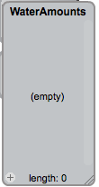
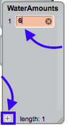
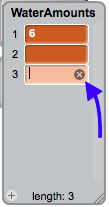
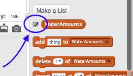

## Using a list

Instead of typing the amounts of water directly into the `repeat until`{:class="blockcontrol"} loops, it's a good idea to use variables. A **list** variable lets you keep all the numbers together in, you guessed it, a list!

+ Go to the **Data** section of blocks and click **Make a List**.

+ Enter `WaterAmounts` as the name and click **OK**.

Your list will appear on the stage.



+ Click the `+` at the bottom of the list and type in the number `6`. This is the number of litres for your first illustration, the running tap.



--- collapse ---
---
title: Removing an item
---

+ If you want to remove items from the list, you can click on the item you want to delete, then click the little `x` that appears next to it.



--- /collapse ---

+ Add another item for your second illustration for flushing the toilet. The value for this one is `6` as well.

+ You can untick the checkbox next to your list in the **Data** section to hide it from the stage.



Now you will use the values from your list to tell the loop how many times to repeat.

+ Look for this block in the blocks for you list in **Data**:

```blocks
    item (1 v) of [WaterAmounts v]
```

+ Find your `repeat`{:class="blockcontrol"} loop for the `Tap`, and plug in the above block instead of the number `6` you typed in earlier.

+ Do the same for the second `repeat`{:class="blockcontrol"} loop, the one for `Toilet`.

+ In the block you put into the second `repeat`{:class="blockcontrol"} loop, click on the `1` and change it by typing in the number `2`.

--- collapse ---
---
title: How does it work?
---

The block

```blocks
    item (1 v) of [WaterAmounts v]
```

lets you select a thing from your list. 

The number chooses which thing to select. It represents a place in the list. So item `1` is the first thing on the list, item `2` is the second, and so on.

This number is called the **index**.

--- /collapse ---

+ Check that your loops look like this, and then run your code to test it.

```blocks
    go to [Tap v]
    move (45) steps
    repeat (item (1 v) of [WaterAmounts v])
        move (20) steps
        stamp
        wait (0.5) secs
    end
    go to [Toilet v]
    move (45) steps
    repeat (item (2 v) of [WaterAmounts v])
        move (20) steps
        stamp
        wait (0.5) secs
    end
```

You should see it do the same thing as before! The only difference is that now you're getting the number of repeats from a list instead of having typed it directly into the `repeat`{:class="blockcontrol"} block.

So you've managed to replace one set of numbers with a list. How about doing the same with the sprites that match up with those numbers? You'll do this on the next card!
