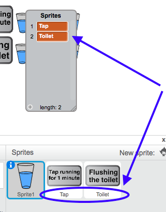

## Matching things up

Now that you've got the water amounts in a list, you're going to put the sprite names in another list. Since the sprite names and the water amounts are related to each other, you'll be using the same counter variable to keep track of which list item you're on in both lists.

+ Make another list and call it `Sprites`.

+ Add two items to the list: `Tap` and `Toilet`. Make sure that what you type is exactly the same as the names of the `Tap` and `Toilet` sprites!



+ Once you're done adding things to the list, you can hide it from the stage.

+ Now look at your script with the loops and find the two `go to`{:class="blockmotion"} blocks that make the talking sprite move to the `Tap` and the `Toilet` sprites.

```blocks
    go to [Tap v]
```

+ Just like you did before, drag an `item`{:class="blockdata"} block into each one — it doesn't look like you can place something else into the box, but you can! Give it a try.

```blocks
    go to (item (1 v) of [Sprites v])
```

+ Your code should look like this now:

```blocks
    go to (item (1 v) of [Sprites v])
    move (45) steps
    repeat (item (1 v) of [WaterAmounts v])
        move (20) steps
        stamp
        wait (0.5) secs
    end
    go to (item (2 v) of [Sprites v])
    move (45) steps
    repeat (item (2 v) of [WaterAmounts v])
        move (20) steps
        stamp
        wait (0.5) secs
    end
```

Do you see that you are now using the same **index** to select the sprite name from a list and the matching water amount from the other list? This is the perfect opportunity to use a variable. Let's do that now!

+ Create a new variable called `counter`{:class="blockdata"}.

+ At the start of the program, set the value of `counter`{:class="blockdata"} to `0`:

```blocks
    when green flag clicked
    set [counter v] to [0]
```

+ Drag the `counter`{:class="blockdata"} block into the four blocks where you get an item from a list, in place of the numbers `1` and `2`.

```blocks
    go to (item (counter) of [Sprites v])
```

```blocks
    repeat (item (counter) of [WaterAmounts v])
```

One thing is still missing: the value of `counter`{:class="blockdata"} is `0` at the moment! You need to set it to the correct value before you use it each time. To do this, you will add `1`. This is also known as **incrementing**.

+ Add in two `change counter by 1`{:class="blockdata"} blocks into your code so that it looks like this:

```blocks
    change [counter v] by (1)
    go to (item (counter) of [Sprites v])
    move (45) steps
    repeat (item (counter) of [WaterAmounts v])
        move (20) steps
        stamp
        wait (0.5) secs
    end
    change [counter v] by (1)
    go to (item (counter) of [Sprites v])
    move (45) steps
    repeat (item (counter) of [WaterAmounts v])
        move (20) steps
        stamp
        wait (0.5) secs
    end
```

+ Run your code to check that everything is still working as it should! Here is what the full program should look like by now:

```blocks
    when green flag clicked
    set [counter v] to [0]
    clear
    go to x:(0) y:(0)
    set [totalWater v] to [0]
    set size to (80) %
    switch costume to [monkey2-a v]
    ask [How many times do you flush the toilet each week?] and wait
    set [flushes v] to (answer)
    change [totalWater v] by ((flushes) * (6))
    ask [How many minutes do you usually spend in the shower?] and wait
    set [showerMinutes v] to (answer)
    ask [How many showers do you have per week?] and wait
    set [showers v] to (answer)
    change [totalWater v] by ((showers) * ((showerMinutes) * (7)))
    say [You use...] for (2) secs
    say (join(totalWater) [ litres of water per week!]) for (5) secs
    say [How about brushing your teeth?] for (2) secs
    say [It can be tempting to leave the tap running while you brush. But did you know...] for (4) secs
    say [...a running tap loses 6 litres of water per minute?] for (3) secs
    switch costume to [glass water-a v]
    set size to (35) %
    change [counter v] by (1)
    go to (item (counter) of [Sprites v])
    move (45) steps
    repeat (item (counter) of [WaterAmounts v])
        move (20) steps
        stamp
        wait (0.5) secs
    end
    change [counter v] by (1)
    go to (item (counter) of [Sprites v])
    move (45) steps
    repeat (item (counter) of [WaterAmounts v])
        move (20) steps
        stamp
        wait (0.5) secs
    end
```

On the next card you will learn how to make your code even shorter with another clever loop!
