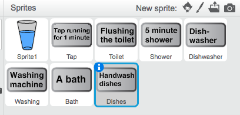
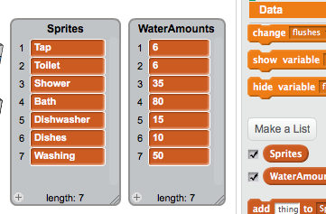

## Repetition is key

Right now you have two sets of code blocks in your script that are identical:

```blocks
    change [counter v] by (1)
    go to (item (counter) of [Sprites v])
    move (45) steps
    repeat (item (counter) of [WaterAmounts v])
        move (20) steps
        stamp
        wait (0.5) secs
    end
```

If you were to add more sprites to illustrate amounts of water for other things like showers or washing dishes, this would very quickly get out of hand! Seems like these blocks should be inside a loop of some sort, right?

+ On your script, detach the first `change counter by 1`{:class="blockdata"} block and everything after it, and drag it to one side (don't delete it just yet!), so that the last blocks in your green flag script are:

```blocks
    switch costume to [glass water-a v]
    set size to (35) %
```

+ Look in the **Control** section and take out this block:

```blocks
    repeat until <>
    end
```

+ Attach it after the `set size to 35%`{:class="blocklooks"} block.

+ Then take one group of the other blocks and put it inside the loop. You can now delete the other identical set of those blocks, as you no longer need them!

```blocks
    switch costume to [glass water-a v]
    set size to (35) %
    repeat until <>
        change [counter v] by (1)
        go to (item (counter) of [Sprites v])
        move (45) steps
        repeat (item (counter) of [WaterAmounts v])
            move (20) steps
            stamp
            wait (0.5) secs
        end
    end
```

Finally, you need to put something in the `until`{:class="blockcontrol"}! You want the code to repeat for each item in the lists, so a good thing to check for would be whether the counter has reached the last item in one of them. You can use another handy block here, from the list blocks in **Data**:

```blocks
    length of [Sprites v]
```

+ The first thing you'll need is an **operator** block to check if two things are equal:

```blocks
    [] = []
```

+ Place this into the space in the `repeat until`{:class="blockcontrol"} block:

```blocks
    repeat until <[] = []]>
    end
```

+ Grab the `counter`{:class="blockdata"} block and plug it into the left-hand side of the operator block.

+ Then, from **Data**, place the `length of`{:class="blockdata"} block into the right-hand side of the operator.

```blocks
    repeat until <(counter) = (length of [Sprites v])>
    end
```

--- collapse ---
---
title: About the new loop
---

You've used the `repeat`{:class="blockcontrol"} with a number to tell Scratch how many times to repeat something. 

But if you add more things to your lists of sprites and water amounts, you'll have to change the code each time to update the the `repeat`{:class="blockcontrol"} number. 

With a `repeat until`{:class="blockcontrol"} block, the code checks how many times it needs to repeat so that you don't have to!

--- /collapse ---

+ Click the green flag to see your new and improved script run — it does the same thing using half the amount of blocks!

Let's really make the most of this new loop and make the program display some more water usage information.

+ Create five more sprites, naming them `Shower`, `Bath`, `Dishwasher`, `Dishes`, and `Washing`. You can give them more descriptive text on their costumes if you want to.



Here are the descriptions I've used:

| Sprite name | Text description | 
|-----|-------|
| Shower | 5-minute shower |
| Bath | A bath |
| Dishwasher | Dishwasher |
| Dishes | Handwash dishes|
| Washing | Washing machine |

+ Tick the checkboxes to show both your lists on the stage so you can add the new information to them.

+ Add all the new sprite names to the `Sprites`{:class="blockdata"} list, making sure to type them exactly correct.

+ Then add the water usage to the `WaterAmounts`{:class="blockdata"} list. The table below shows the litres of water for each thing. Make sure you add them in the same order as the sprites, so that their list index numbers match up!

| Sprite | WaterAmount | 
|-----|-------|
| Shower | 35 |
| Bath | 80 |
| Dishwasher | 15 |
| Dishes | 10|
| Washing | 50 |



+ Finally, hide the lists again by unticking the checkboxes next to the code blocks, and click the green flag to run the code. You should see all the new water amounts get animated — without having to add any new code! Cool, right?

You might notice some of the items run out of space on the screen because the amount of water is so huge, and maybe you want to speed up the animation a little. The next card will show you some small tweaks you can make to fix all this.
